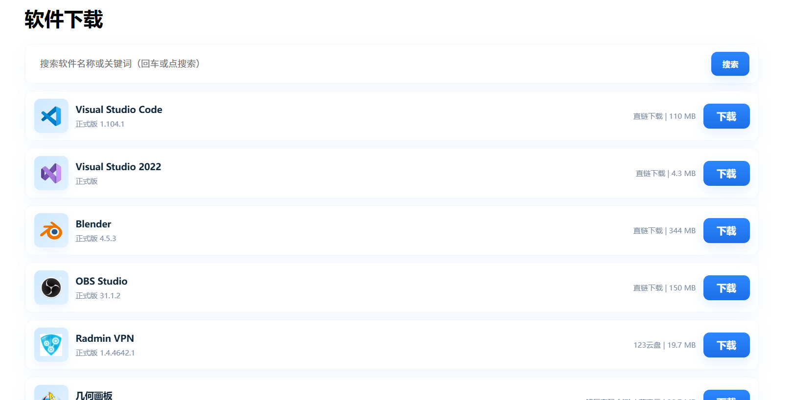

# YesieLife Download 📦

**YesieLife Download - Software Resource Aggregation Platform**

[中文介绍](#中文介绍) | [English](#english)

---

# 中文介绍

## 项目简介

YesieLife Download 是 YesieLife 生态中的软件下载聚合网页项目。

本项目提供一个简洁、高效的软件资源展示与下载入口，通过网页形式集中管理不同平台的软件资源。

用户可以通过搜索功能快速查找软件，并获取对应的下载链接。

本仓库保存 YesieLife Download 网页的完整源代码。

---

## 项目特点

- 📦 软件资源聚合展示
- 🔍 支持软件名称和关键词搜索
- 🖥️ 多平台资源分类
- 🖼️ 软件图标与信息展示
- 🔗 下载链接管理
- ⚡ 流畅的搜索动画效果
- 🛠️ 轻量化前端实现

---

## 功能介绍

### 软件列表展示

网站通过 JavaScript 数据文件动态生成软件卡片。

每个软件包含：

- 软件名称
- 软件图标
- 软件简介
- 软件版本
- 文件大小
- 下载地址

---

### 搜索功能

支持：

- 软件名称搜索
- 关键词搜索
- 回车搜索
- 搜索按钮触发

搜索过程中使用动画优化页面变化效果：

- 元素位置平滑移动
- 匹配项优先显示
- 不匹配项自动隐藏
- 无结果提示

---

### 数据管理

软件信息通过独立数据文件管理：

```javascript
softwareData = [
    {
        name,
        keywords,
        icon,
        url,
        desc,
        size
    }
]
```

通过修改 `data.js` 即可快速添加或更新软件资源。

---

## 支持平台

项目目录包含：

- Android
- iOS
- macOS
- Windows / PC

用于未来扩展不同平台的软件资源。

---

## 使用技术

### Front-end

- HTML
- CSS
- JavaScript

### JavaScript Features

- DOM 操作
- 动态内容渲染
- 搜索过滤
- FLIP 动画
- CSS Transition

### 开发工具

- Visual Studio Code
- Git & GitHub

---

## 项目结构

```
YesieLife-Download/
├── android/                 # Android 软件资源
├── files/                   # 下载文件及资源
├── ios/                     # iOS 软件资源
├── mac/                     # macOS 软件资源
├── pc/                      # Windows / PC 软件资源
│
├── data.js                  # 软件数据列表
├── index.html               # 下载主页
├── script.js                # 页面逻辑与搜索功能
├── style.css                # 页面样式
├── scphoto100.png           # 网站截图
```

---

## 网站截图



---

## 在线访问

官方网站：

https://yesongchina.com

---

## 开发计划

未来可能继续完善：

- 📱 更完善的平台分类
- 🔎 更智能的软件搜索
- 📊 软件版本管理
- 📝 软件详细介绍页面
- 🌐 国际化支持

---

## 开源说明

本项目主要用于：

- Web 开发学习
- 个人项目实践
- 软件资源管理实验

欢迎查看代码并提出改进建议。

---

# English

## Introduction

YesieLife Download is a software resource aggregation website in the YesieLife ecosystem.

This project provides a simple and efficient platform for displaying and accessing software download resources.

Users can quickly find software through the search function and access corresponding download links.

This repository contains the complete source code of the YesieLife Download website.

---

## Features

- 📦 Software resource aggregation
- 🔍 Software name and keyword search
- 🖥️ Multi-platform resource organization
- 🖼️ Software information display
- 🔗 Download link management
- ⚡ Smooth search animations
- 🛠️ Lightweight front-end implementation

---

## Functions

### Software List

Software information is dynamically generated through JavaScript.

Each software item contains:

- Name
- Icon
- Description
- Version
- File size
- Download URL

---

### Search System

Supports:

- Software name search
- Keyword search
- Enter key search
- Search button interaction

The search system includes:

- Smooth element movement
- Match priority sorting
- Automatic hiding of unmatched items
- No-result notification

---

### Data Management

Software information is stored separately in `data.js`.

Example:

```javascript
softwareData = [
    {
        name,
        keywords,
        icon,
        url,
        desc,
        size
    }
]
```

New software can be added easily by editing the data file.

---

## Supported Platforms

Current structure includes:

- Android
- iOS
- macOS
- Windows / PC

---

## Technologies

### Front-end

- HTML
- CSS
- JavaScript

### JavaScript Features

- DOM manipulation
- Dynamic rendering
- Search filtering
- FLIP animation
- CSS transitions

---

## Project Structure

```
YesieLife-Download/
├── android/
├── files/
├── ios/
├── mac/
├── pc/
│
├── data.js
├── index.html
├── script.js
├── style.css
├── scphoto100.png
```

---

## Website

Visit:

https://yesongchina.com

---

## Roadmap

Future plans:

- Better platform categories
- Smarter search system
- Software version management
- Detailed software pages
- Internationalization support

---

## License

This project is created for web development learning, personal projects and software resource management experiments.

Feel free to explore the source code and share suggestions.

---

Made with ❤️ by King Feng
